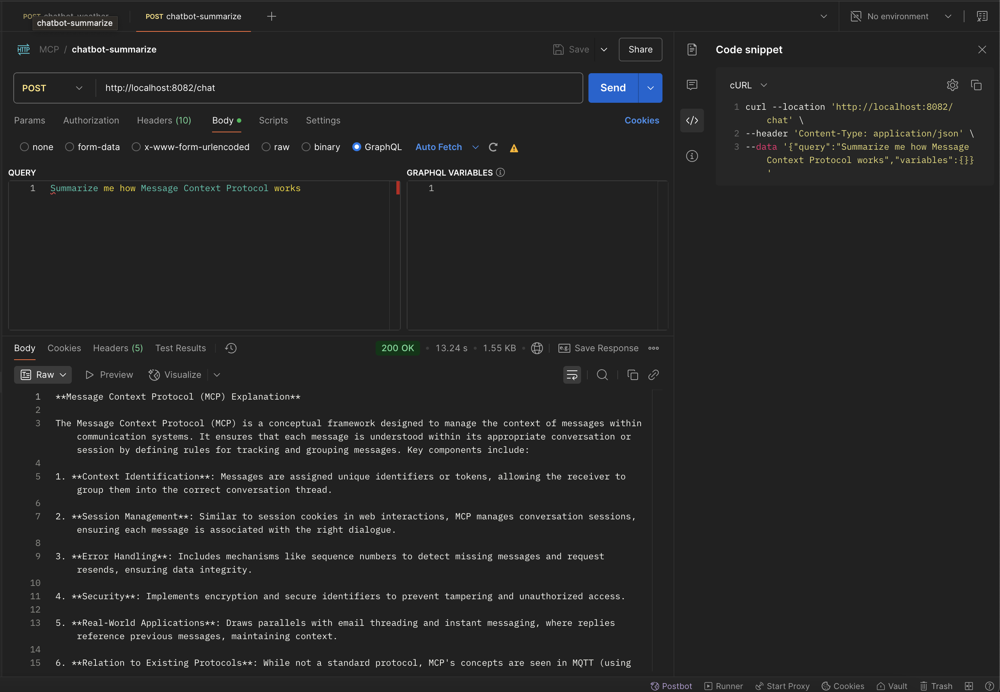

# Spring AI Demo

A simple Spring Boot project experimenting with
- LLMs (Large Language Models),
- Weather API, and
- Google Calendar API  
  This project is my first attempt at building a Java-based wrapper (a tiny “personal assistant”) around AI


## Features
- **Ask anything**→ forwards your query to an LLM (using Spring AI integration + a free openrouter LLM model ). 
- **Weather check** → get real-time weather for any city.
- **Calendar booking** → book events in Google Calendar with natural language prompts like:
  > *"Book a meeting tomorrow at 3 PM for dentist"*  
  > *"Book a lunch in my calendar at 12pm on 4th Oct 2025"*
  

## Tech Stack
- Java 21
- Spring Boot 3.x
- Spring AI
- Google Calendar API
- REST API (JSON)

## Getting Started

### 1. Clone the repository
```bash
git clone https://github.com/SunilGhargaonkar/spring-ai-demo.git
cd spring-ai-demo
```
### 2. update application.property file
#### Google OAuth2 credentials (path relative to project root)
`google.credentials.path=credentials.json`

### LLM provider (e.g., Ollama, OpenAI, OpenRouter, HuggingFace, etc.)
For the demo sake, I have used openrouter LLM

### 3. Run the application
` mvn spring-boot:run `

### 4. Test the application
#### Event Booking
```bash
curl --location 'http://localhost:8082/chat' \
--header 'Content-Type: application/json' \
--data '{"query":"Book an event tomorrow for my dentist\n","variables":{}}'
```

#### Weather Query
```bash
curl --location 'http://localhost:8082/chat' \
--header 'Content-Type: application/json' \
--data '{"query":"what'\''s the weather in London today","variables":{}}'
```

#### Summarization Query
```bash
curl --location 'http://localhost:8082/chat' \
--header 'Content-Type: application/json' \
--data '{"query":"Summarize me how Message Context Protocol works","variables":{}}'
```

